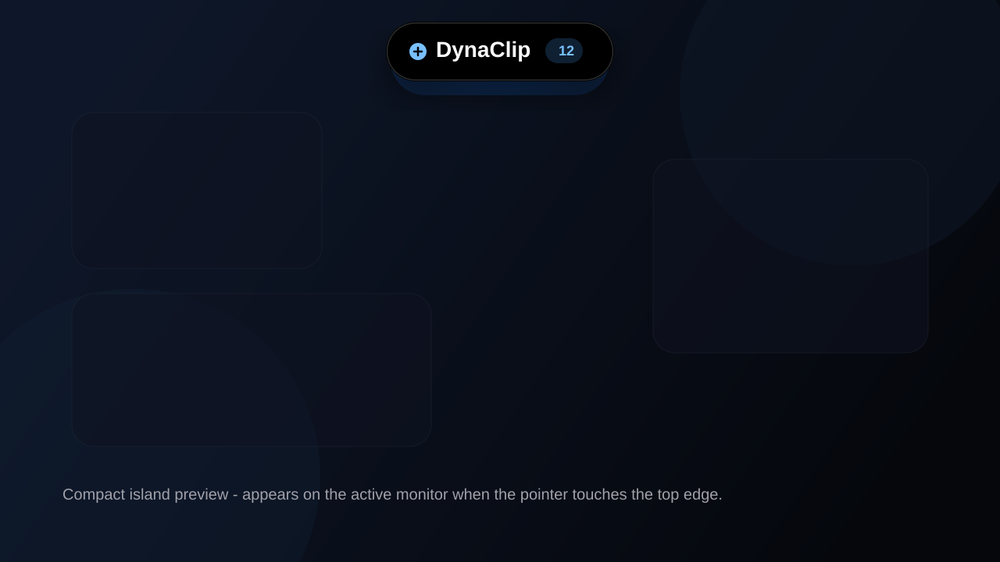
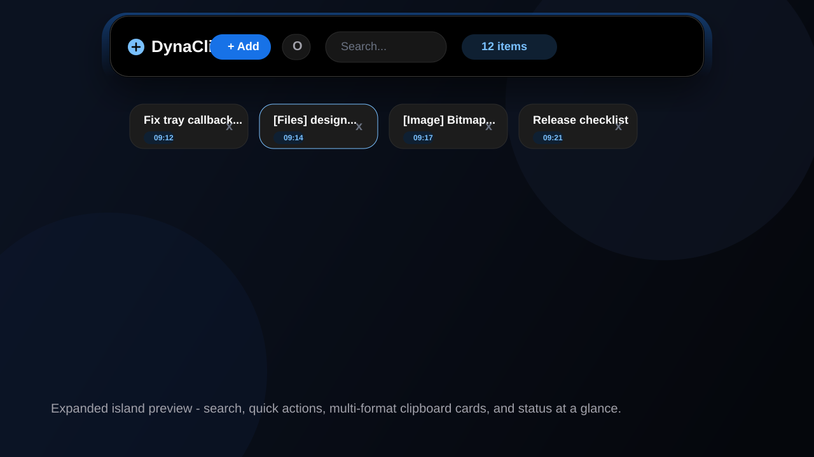
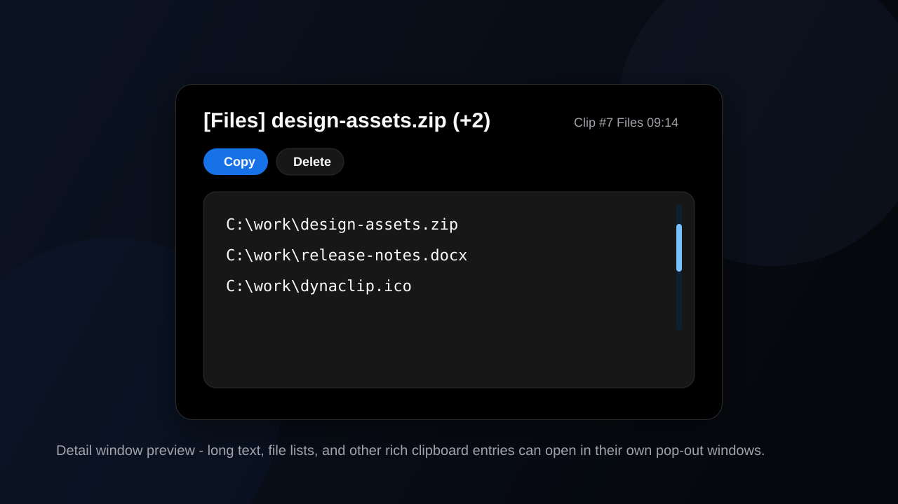

# DynaClip

Windows clipboard history as a Dynamic Island.

DynaClip is a lightweight, memory-only clipboard utility that appears as a compact pill at the top of your screen and expands into a clipboard shelf when you click it.

- Landing page: `landing/index.html`

## Screenshots

### Compact island



### Expanded island



### Detail pop-out window



## Highlights

- Dynamic Island-style compact pill and expanded shelf
- Tray icon and global toggle hotkey
- Multi-monitor aware positioning
- Multi-window clip detail pop-outs
- Text, file-list, and bitmap-image clipboard support
- Sensitive-text filtering and auto-purge support
- DPAPI-encrypted local settings and encrypted diagnostic logs
- Memory-only history with no plaintext disk persistence of clipboard contents
- Startup toggle, settings persistence, and release packaging assets

## What it does

- Shows a compact island when your mouse touches the top edge of the current monitor
- Expands into a searchable clipboard shelf on click
- Lets you re-copy, delete, and inspect clips quickly
- Supports multi-monitor positioning
- Supports multi-window clip pop-outs for long text
- Supports text, file lists, and bitmap image clipboard entries
- Keeps clipboard history in memory only

## Main interactions

- Reveal compact island: move mouse to the top edge of a monitor
- Expand island: click the compact pill
- Toggle by hotkey: `Ctrl+Shift+Space`
- Search clips: `Ctrl+F` in the expanded island
- Copy clip: single-click a clip card
- Open clip in its own window: double-click a clip card
- Delete clip: click `x`
- Collapse: move away or press `Esc`

## Settings menu

Use the island menu to:

- Clear all history
- Toggle duplicate handling
- Toggle auto-capture mode
- See current item count
- Exit the app

## Auto-capture

By default, DynaClip watches the clipboard but only stores text when you click `Add`.

If you enable auto-capture from the menu, new clipboard text is automatically added to history.

Supported clipboard formats:

- Text
- File lists
- Bitmap images (DIB)

## Security model

- Clipboard history stays in memory during runtime
- Persisted app settings are stored encrypted with Windows DPAPI
- Diagnostic logs are stored encrypted and do not contain clipboard payloads
- Sensitive-looking text can be filtered before it enters history
- Auto-purge trims in-memory history over time to reduce retained exposure

Important note:

- Clipboard contents themselves are not encrypted while held in RAM, because the app must display and restore them while running
- Once content is copied back to the Windows clipboard, it is subject to normal Windows clipboard behavior and visibility

## Running it

### Python

```bash
pythonw dynaclip_qt.py
```

Or double-click `DynaClip.bat`.

The legacy Tk implementation is still available as `dynaclip.py`.

For the packaged desktop app, run `dist/DynaClip.exe`.

### Qt prototype

To compare a smoother compositor-backed animation path, install the Qt dependency and run the prototype:

```bash
pip install -r requirements-qt.txt
python dynaclip_qt.py
```

## Chrome Extension Prototype

There is also a browser-side prototype in `chrome-extension/` that keeps copied text in a single Chrome popup.

Load it from `chrome://extensions` using **Load unpacked**, then select `chrome-extension`.

### Build a standalone exe

```bash
pip install pyinstaller
python -m PyInstaller DynaClip.spec
```

The built executable will appear in `dist`.

To install a simple startup launcher for the built app:

```powershell
powershell -ExecutionPolicy Bypass -File .\install.ps1
```

To uninstall the startup launcher:

```powershell
powershell -ExecutionPolicy Bypass -File .\uninstall.ps1
```

To run the release build workflow:

```powershell
powershell -ExecutionPolicy Bypass -File .\build_release.ps1
```

To build an installer, compile `DynaClip.iss` with Inno Setup after the exe has been built.

Release artifacts and checklists:

- `RELEASE_CHECKLIST.md`
- `QA_MATRIX.md`
- `RELEASE_NOTES_0.3.0.md`
- `PRE_RELEASE_AUDIT.md`
- `DynaClip.iss`

## Notes

- Windows only
- Single-instance app; launching again will show a message instead of opening a second island
- Clipboard history is not persisted to disk
- Works per active monitor based on pointer location

## Release workflow

1. Run `python smoke_test.py`
2. Build the exe with `powershell -ExecutionPolicy Bypass -File .\build_release.ps1`
3. Validate behavior with `QA_MATRIX.md`
4. Review `PRE_RELEASE_AUDIT.md`
5. Compile `DynaClip.iss` with Inno Setup for an installer build

## Project files

```text
dynaclip.py
DynaClip.spec
DynaClip.bat
build_release.ps1
install.ps1
uninstall.ps1
DynaClip.iss
README.md
```

## License

See `LICENSE`.
